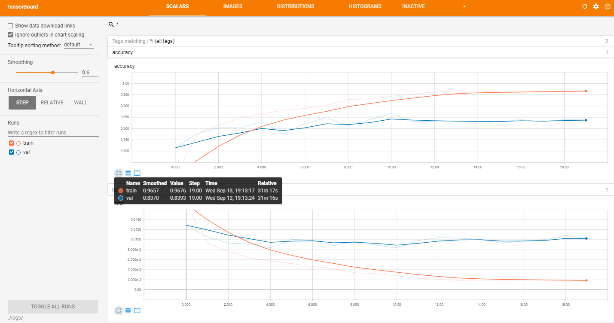
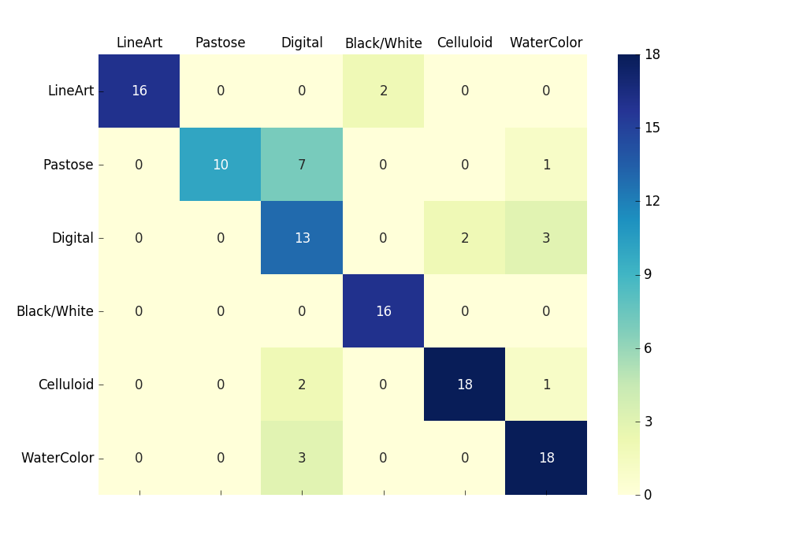

# Coloring Style Classification
Little ex with self-collected data.

## Dataset
The dataset was crawled from pixiv and clean manually.  
The total number of training and validation data are 4134 and 112, respectively.

## CNN architecture
Using pre-trained resnet-18 provided by torchvision.

## Train-val Curve Visualization in Tensorboard

## Confusion Matrix

